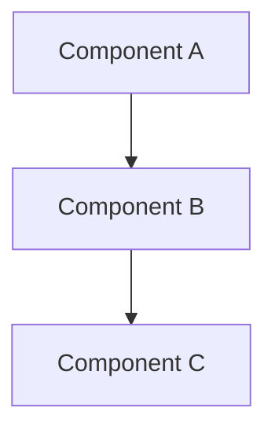

# Design: [Feature Name]

## Overview

[High-level description of the solution approach.]

## Architecture

[Describe the overall system design. Use Mermaid diagrams where helpful.]



## Components and Interfaces

### [Component 1]

- **Purpose:** [What it does]
- **Interface:** [Key functions/APIs/endpoints]
- **Dependencies:** [What it depends on]

### [Component 2]

- **Purpose:** [What it does]
- **Interface:** [Key functions/APIs/endpoints]
- **Dependencies:** [What it depends on]

## Data Models

```python
# Example data structure
class ExampleModel:
    field1: str
    field2: int
```

## Error Handling

| Error | Handling Strategy |
|-------|-------------------|
| [Error type] | [How to handle] |

## Testing Strategy

- **Unit tests:** [What to unit test]
- **Integration tests:** [What to integration test]
- **Manual verification:** [What to verify manually]

## Design Decisions

| Decision | Rationale | Alternatives Considered |
|----------|-----------|------------------------|
| [Decision] | [Why] | [What else was considered] |

## Requirements Coverage

| Requirement | Covered by |
|-------------|------------|
| 1.1 | [Component/section] |
| 1.2 | [Component/section] |
